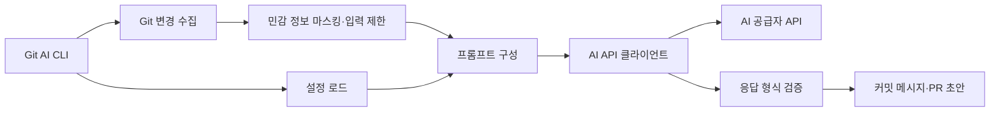

# AI Git 커밋·PR 초안 생성기

## 프로젝트 소개

현재 Git 저장소의 상태와 스테이징된 변경을 수집해 AI API에 전달하고 커밋 메시지와 PR 초안을 출력하는 Python CLI입니다. 결과를 검토한 뒤 직접 적용하는 도구입니다.

## 핵심 특징

- 커밋 메시지와 PR 제목·본문 초안 생성
- `.ai-gitgen.yml`의 팀 규칙 적용과 출력 형식 검증
- 기본 안전 모드에서 비밀정보 패턴 마스킹과 전송량 제한
- API 호출 없는 `--dry-run`과 로컬 모의 응답 지원
- 요청별 AI API 1회 호출과 오류 안내

## 아키텍처

`CLI → Git 변경 수집 → 안전 처리 → 프롬프트 구성 → API 클라이언트 → 응답 검증` 흐름입니다.

| 경로 | 역할 |
| --- | --- |
| `src/ai_gitgen/__main__.py` | CLI 진입점 |
| `src/ai_gitgen/` | 설정·Git 수집·안전 처리·AI 요청·출력 검증 |
| `.ai-gitgen.yml` | 커밋 제목과 PR 섹션 규칙 |
| `.env.example`, `.env.openai.example` | 공급자별 환경 설정 예시 |
| `docs/usage.md` | 실행 옵션과 출력 계약 |
| `scripts/check.py` | 문법·문서 링크 검사 |
| `tests/` | pytest 단위·모의 API·CLI 실행 검증 |



소스는 `src/ai_gitgen/`, 회귀 테스트는 `tests/`, 개발 보조 도구는 `scripts/`에 둡니다. `pyproject.toml`이 패키지·명령·개발 도구를 선언하고 `uv.lock`이 설치 버전을 고정합니다. `uv sync --frozen`은 소스를 개발 모드로 설치하므로 앱 실행과 테스트에 별도 `PYTHONPATH` 설정이 필요하지 않습니다.

## 실행 환경과 시작하기

Python 3.10 이상, uv, Git CLI가 필요합니다. Python 표준 라이브러리만 사용합니다. 저장소 루트에서 실행합니다.

```bash
uv sync --frozen
uv run --frozen git-ai --help
uv run --frozen git-ai commit --dry-run --safe-mode
```

실제 변경 초안을 만들 때는 먼저 필요한 변경을 `git add`로 스테이징합니다. 코드가 수집하는 diff는 `git diff --cached`입니다. 추적되지 않은 파일과 스테이징하지 않은 본문은 이 diff에 포함되지 않습니다.

## AI 연결 설정

```bash
cp .env.example .env
# .env의 AI_API_KEY 등 설정을 채운 뒤 현재 셸로 불러옵니다.
. ./.env
uv run --frozen git-ai commit --safe-mode
uv run --frozen git-ai pr --safe-mode
```

`.env`는 자동으로 읽지 않습니다. 예시 파일은 `export` 구문이 있는 셸 환경 파일입니다.

| 변수 | 동작 |
| --- | --- |
| `AI_API_KEY` | 실제 API 호출 시 필요한 인증 키 |
| `AI_API_BASE_URL` | OpenAI 호환 Chat Completions 요청 주소 |
| `AI_MODEL` | 모델 기본값 재정의; `--model` 옵션으로도 지정 가능 |

현재 코드 기본값은 Gemini 호환 주소와 `gemini-3.5-flash`입니다. 기본 문자열은 공급자의 모델 제공 상태를 보장하지 않으므로 계정에서 사용할 수 있는 모델과 요청 주소를 지정합니다. OpenAI를 사용할 때는 `.env.openai.example`을 `.env`로 복사합니다. 이 예시는 OpenAI 요청 주소와 `gpt-4.1-mini` 모델을 함께 설정하며, 키와 모델을 계정에 맞게 수정한 뒤 `. ./.env`로 불러옵니다.

## 안전 모드와 출력 계약

기본적으로 diff는 최대 10개 파일·200줄로 제한하고, 파일 목록과 Git status도 각각 최대 10행으로 제한합니다. 세 입력 모두 이메일·키·토큰·비밀번호 패턴을 마스킹합니다. 행 제한은 Git 입력에 적용되며 프롬프트의 고정 설명과 팀 규칙은 별도로 포함합니다. 마스킹은 모든 민감정보 탐지를 보장하지 않습니다. 실제 호출 전에 `--dry-run`과 스테이징 내용을 확인합니다.

PR 섹션명 `What`, `Why`, `How`와 출력 구분자는 기존 검증 계약을 유지합니다. 옵션, 길이 제한, 표준 입력 검증 예시는 [사용법](docs/usage.md)에 있습니다.

## 검증

```bash
make check
make test
make smoke
make build
```

임시 Git 저장소의 스테이징 변경으로 수집·마스킹·모의 응답·출력 검증을 확인합니다. 외부 API 호출이나 실제 커밋·PR 생성은 수행하지 않습니다.

`make check`는 정적 분석·포맷·문서 검사를, `make test`는 `uv run --frozen pytest -q`로 등록된 회귀 테스트를 실행합니다. 최종 HTTP payload의 마스킹·파일/행 제한, API 실패, 출력 거부, 설정 파서를 임시 Git 저장소와 모의 HTTP 응답으로 검증합니다. `make smoke`는 `smoke` 마커가 붙은 dry-run·모의 생성·출력 검증 경로만 선택합니다(`uv run --frozen pytest -q -m smoke`). 실제 공급자 API 호환성은 자동 테스트 범위에 포함하지 않습니다.
